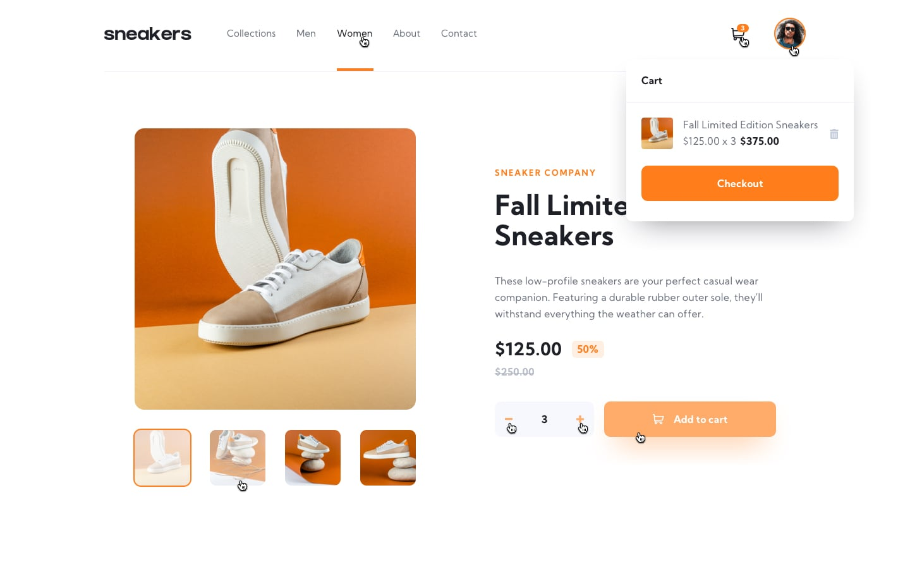

# Frontend Mentor - E-Commerce Product Page Solution


This is a solution to the [E-commerce product page challenge on Frontend Mentor](https://www.frontendmentor.io/challenges/ecommerce-product-page-UPsZ9MJp6).

## Table of Contents 📜

- [Overview](#overview)
  - [The Challenge](#thechallenge)
  - [About The App Built](#abouttheapp)
  - [How To Run The Project](#howtoruntheproject)
- [Screenshots - Mobile](#screenshotsmobile)
- [Screenshots - Desktop](#screenshotsdesktop)
- [Built With](#builtwith)

## Overview <a name="overview"></a>

### The Challenge <a name="thechallenge"></a> 🎯
The challenge was to build a responsive e-commerece product web page for mobile and desktop devices, following the design files and trying to keep as close as possible to them.

The users should be able to:

- View the optimal layout for the site depending on their device's screen size ✔️
- See hover states for all interactive elements on the page ✔️
- Open a lightbox gallery by clicking on the large product image ✔️
- Switch the large product image by clicking on the small thumbnail images ✔️
- Add items to the cart ✔️
- View the cart and remove items from it ✔️

### About the app built <a name="abouttheapp"></a>
It's an e-commerce product web page, you can add the item (autumn sneakers) to the cart how many times you want, see all the images about the product by clicking on the arrow buttons (mobile & lightbox opened) of by the thumb images below the main image (only screens with >= 992px).

- The items in the cart are being stored in the user's browsers, in **session storage**, which means they will only be available while the browser section is opened.

## 🛠️ How to run the project <a name="howtoruntheproject"></a>
- You can download or clone the project, once you have the files you'll need a server to run the application. You can use the *live server* from visual studio code, for example. The main file is the ```index.html```
- You can access the [live site](https://aniru-dh21.github.io/E-Commerce-Product-Page/)

## Screenshots - Mobile <a name="screenshotsmobile"></a> 📱
<table align="center">
  <thead>
    <tr>
      <th>
        <h3>Design</h3>
      </th>
      <th>
        <h3>App Built</h3>
      </th>
    </tr>
  </thead>
  <tbody>
    <tr>
      <td>
        <h4><em>Home screen</em></h4>
        
      </td>
      <td>
        <h4><em>Home screen</em></h4>
        
      </td>
    </tr>
    <tr>
      <td>
        <h4><em>Cart Empty</em></h4>
        
      </td>
      <td>
        <h4><em>Cart Empty</em></h4>
        
      </td>
    </tr>
    <tr>
      <td>
        <h4><em>Cart Filled</em></h4>
        
      </td>
      <td>
        <h4><em>Cart Filled</em></h4>
        
      </td>
    </tr>
    <tr>
      <td>
        <h4><em>Menu Opened</em></h4>
        
      </td>
      <td>
        <h4><em>Menu Opened</em></h4>
        
      </td>
    </tr>
  </tbody>
</table>

## Screenshots - Desktop <a name="screenshotsdesktop"></a> 🖥️
<table align="center">
  <tr>
    <td>
      <h3><em>Home Screen Design</em></h3>
      
    </td>
  </tr>
  <tr>
    <td>
      <h3><em>Home Screen App Built</em></h3>
      
    </td>
  </tr>
  <tr>
    <td>
      <h3><em>Cart Empty Design</em></h3>
      
    </td>
  </tr>
  <tr>
    <td>
      <h3><em>Cart Empty App Built</em></h3>
      
    </td>
  </tr>
  <tr>
    <td>
      <h3><em>Cart Filled Design</em></h3>
      
    </td>
  </tr>
  <tr>
    <td>
      <h3><em>Cart Filled App Built</em></h3>
      
    </td>
  </tr>
  <tr>
    <td>
      <h3><em>Lightbox Opened Design</em></h3>
      
    </td>
  </tr>
  <tr>
    <td>
      <h3><em>Lightbox Opened App Built</em></h3>
      
    </td>
  </tr>
</table>  

## Built With <a name="builtwith"></a>
- Semantic HTML5 markup
- CSS & JS custom properties
- Flexbox
- CSS Grid
